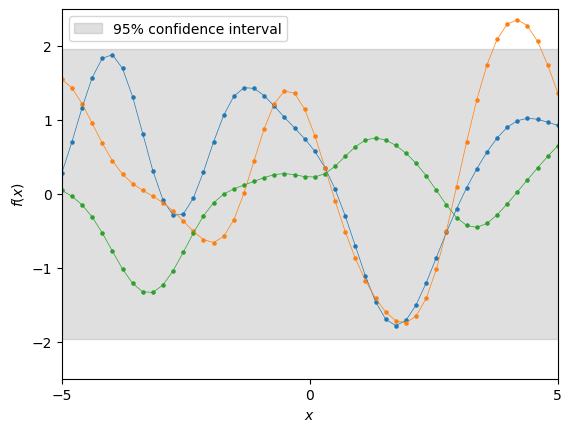
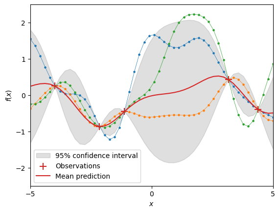
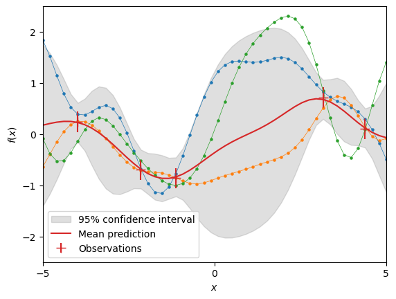
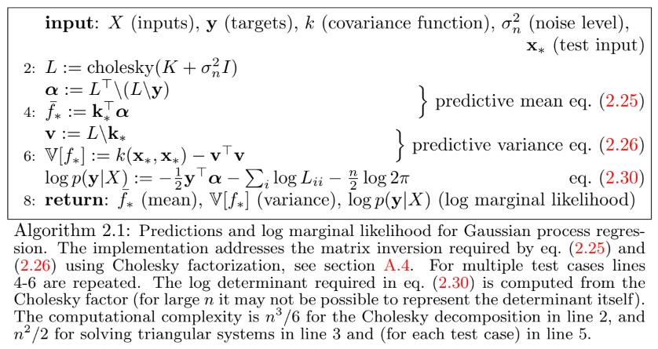

> __References__
>
> 1. C. E. Rasmussen and C. K. I. Williams, *Gaussian Process for Machine Learning,* The MIT Press, 2006. https://gaussianprocess.org/gpml/
> 2. `scikit-learn` User Guide > 1. Supervised learning > 1.7. Gaussian Processes. https://scikit-learn.org/stable/modules/gaussian_process.html
> 3. `scikit-learn` Examples > Gaussian Process for Machine Learning. https://scikit-learn.org/stable/auto_examples/gaussian_process/index.html


# Chapter 2. Regression


## 2.1 Weight-space View

Let $\mathcal{D}=\bigl\{ (\mathbf{x}_n,y_n)\mid n=1,\dotsc,N \bigr\}$ be a training set of $N$ observations.

- $\mathbf{x}_n\in\mathbb{R}^D$ denotes an input vector (<u>covariates</u>) 
- $y_n\in\mathbb{R}$ denotes a scalar output or target (<u>dependent variable</u>)

We can write $\mathcal{D}=(X,\mathbf{y})$ where

- $X$ is the $N\times D$ <u>design matrix</u> with row vectors $\mathbf{x}_n\in\mathbb{R}^D$
- $\mathbf{y}=(y_1,y_2,\dotsc,y_N)\in\mathbb{R}^N$ is the target vector


### 2.1.1 The Standard Linear Model

> __Reference__: Probabilistic Machine Learning: An Introduction, 11.7 Bayesian linear regression (p.399)

The Bayesian analysis of the standard linear regression model with Gaussian noise:
$$
f(\mathbf{x}) = \mathbf{x}^T\mathbf{w}, \quad y=f(\mathbf{x})+\epsilon, \quad \epsilon\sim\mathcal{N}(0,\sigma_n^2)
$$

- **Likelihood**: The probability density of the observations given the parameters, which is factored over cases in the training set,

$$
p(\mathbf{y}|X,\mathbf{w}) = \prod_{n=1}^N p(y_n|\mathbf{x}_n,\mathbf{w}) = \mathcal{N}(\mathbf{y}|X\mathbf{w},\sigma_n^2I).
$$

- **Prior**: Our beliefs about the parameters before we look at the observations,
  $$
  p(\mathbf{w}) = \mathcal{N}(\mathbf{w}|\mathbf{0},\Sigma_p).
  $$

- **Posterior**: Inference in the Bayesian linear model is based on the posterior distribution over the weights,
  $$
  \text{posterior} = \frac{\text{likelihood}\times\text{prior}}{\text{marginal likelihood}},
  \quad
  p(\mathbf{w}|\mathbf{y},X) = \frac{p(\mathbf{y}|X,\mathbf{w})p(\mathbf{w})}{p(\mathbf{y}|X)}, \tag{2.5}
  $$
  where the <u>marginal likelihood</u> is independent of the weights and given by
  $$
  p(\mathbf{y}|X) = \int p(\mathbf{y}|X,\mathbf{w})p(\mathbf{w})\,d\mathbf{w}.
  $$
  


The **posterior** in (2.5) combines the likelihood and the prior, and captures everything we know about the parameters. Writing only the terms from the likelihood and prior which depend on the weights, we obtain
$$
\begin{align*}
p(\mathbf{w}|X,\mathbf{y}) &\propto \exp \Bigl[ -\frac{1}{2\sigma_n^2}(\mathbf{y}-X\mathbf{w})^T(\mathbf{y}-X\mathbf{w}) \Bigr] \cdot \exp \Bigl[ -\frac{1}{2}\mathbf{w}^T\Sigma_p^{-1}\mathbf{w} \Bigr] \\
&\propto \exp \Bigl[ -\frac{1}{2}(\mathbf{w}^TA\mathbf{w}-2\mathbf{w}^TA\bar{\mathbf{w}}) \Bigr]
\propto \exp \Bigl[ -\frac{1}{2}(\mathbf{w}-\bar{\mathbf{w}})^T A (\mathbf{w}-\bar{\mathbf{w}}) \Bigr]
\end{align*}
$$
where $\bar{\mathbf{w}}=\frac{1}{\sigma_n^2}A^{-1}X^T\mathbf{y}$ and $A=\frac{1}{\sigma_n^2}X^TX+\Sigma_p^{-1}$. Thus the posterior has the form of Gaussian with mean $\bar{\mathbf{w}}$ and covariance matrix $A^{-1}$,
$$
p(\mathbf{w}|X,\mathbf{y}) = \mathcal{N}(\mathbf{w}|\bar{\mathbf{w}},A^{-1}).
$$

- For any <u>Gaussian posterior</u>, the mean $\bar{\mathbf{w}}$ is also its mode, which is called the **maximum a posteriori (MAP)** estimate.
- In a <u>non-Bayesian setting</u> the negative log prior $\frac{1}{2}\mathbf{w}^T\Sigma_p^{-1}\mathbf{w}$ is sometimes thought of as a (L2) <u>penalty term</u> (regularization), and the MAP point is known as the <u>penalized maximum likelihood</u> estimate of the weights.
- However, in the <u>Bayesian setting</u> the MAP estimate <u>plays no special role</u>.
- The (L2) penalized maximum likelihood procedure is known (in this case) as **ridge regression** because of the effect of the <u>quadratic</u> penalty term $\frac{1}{2}\mathbf{w}^T\Sigma_p^{-1}\mathbf{w}$ from the negative log prior.


The **posterior predictive distribution** for <u>(noiseless) function value</u> $f_*\equiv f(\mathbf{x}_*)=\mathbf{x}_*^T\mathbf{w}$ is
$$
p(f_*|\mathbf{x}_*,X,\mathbf{y}) = \mathcal{N}(f_*|\mathbb{E}[f_*],\mathbb{V}[f_*]) = \mathcal{N}(f_*|\mathbf{x}_*^T\bar{\mathbf{w}},\mathbf{x}_*^TA^{-1}\mathbf{x}_*), \tag{2.9}
$$

since $\mathbf{w}\sim p(\mathbf{w}|X,y)=\mathcal{N}(\mathbf{w}|\bar{\mathbf{w}},A^{-1})$.


The **posterior predictive distribution** for <u>noise observation</u> $y_*=f(\mathbf{x}_*)+\epsilon$ is
$$
p(y_*|\mathbf{x}_*,X,\mathbf{y}) = \int p(y_*|\mathbf{x}_*,\mathbf{w})p(\mathbf{w}|X,\mathbf{y})\,d\mathbf{w} = \mathcal{N}(y_*|\mathbf{x}_*^T\bar{\mathbf{w}},\mathbf{x}_*^TA^{-1}\mathbf{x}_*+\sigma_n^2).
$$

> __Reference__: Probabilistic Machine Learning: An Introduction, 3.3.1 Bayes rule for Gaussians (p.85, eq. 3.38)


### 2.1.2 Projections of Inputs into Feature Space

Let $\phi\colon\mathbb{R}^D\to\mathbb{R}^{\bar{D}}$ be a function which maps an input vector $\mathbf{x}\in\mathbb{R}^D$ into a $\bar{D}$ dimensional feature space, and let $\Phi(X)$ be the aggregation ($N\times\bar{D}$ matrix) of rows $\phi(\mathbf{x}_n)\in\mathbb{R}^{\bar{D}}$ for all cases in the training set.

Now the model is $f(\mathbf{x}) = \phi(\mathbf{x})^T\mathbf{w}$ for some parameter $\mathbf{w}\in\mathbb{R}^{\bar{D}}$.
- The analysis for this model is analogous to the standard linear model, except that everywhere $\Phi(X)$ is substituted for $X$.

- The **posterior predictive distribution** (2.9) becomes
  $$
  p(f_*|\mathbf{x}_*,X,\mathbf{y}) = \mathcal{N}(f_*|\phi(\mathbf{x}_*)^T\bar{\mathbf{w}},\phi(\mathbf{x}_*)^TA^{-1}\phi(\mathbf{x}_*)), \tag{2.11}
  $$
  where $\bar{\mathbf{w}}=\frac{1}{\sigma_n^2}A^{-1}\Phi(X)^T\mathbf{y}$ and $A=\frac{1}{\sigma_n^2}\Phi(X)^T\Phi(X)+\Sigma_p^{-1}$.

- We can rewrite the eq. (2.11) in the following way
  $$
  \begin{align*}
  p(f_*|\mathbf{x}_*,X,\mathbf{y}) = \mathcal{N}(f_*| &(\phi_*^T\Sigma_p\Phi^T)(K+\sigma_n^2I)^{-1}\mathbf{y}, \\
  &(\phi_*^T\Sigma_p\phi_*)-(\phi_*^T\Sigma_p\Phi^T)(K+\sigma_n^2I)^{-1}(\Phi\Sigma_p\phi_*)),
  \end{align*} \tag{2.12}
  $$
  where $\phi_*=\phi(\mathbf{x}_*)$, $\Phi=\Phi(X)$, and $K=\Phi\Sigma_p\Phi^T$.

  > ($\because$) For the mean, $\frac{1}{\sigma_n^2}\Phi^T(K+\sigma_n^2I)=A\Sigma_p\Phi^T$ implies $\frac{1}{\sigma_n^2}A^{-1}\Phi^T=\Sigma_p\Phi^T(K+\sigma_n^2I)^{-1}$.
  >
  > For the variance, we use the **matrix inversion lemma**:
  > $$
  > (Z+UWV^T)^{-1} = Z^{-1}-Z^{-1}U(W^{-1}+V^TZ^{-1}U)^{-1}V^TZ^{-1},
  > $$
  > where $Z^{-1}=\Sigma_p$, $W^{-1}=\sigma_n^2I$, and $U=V=\Phi^T$.
  
- In particular, when $N<\bar{D}$, it is more convenient to invert the $N\times N$ matrix $K+\sigma^2I_N$ than to invert the $\bar{D}\times\bar{D}$ matrix $A$.

  

Define $k(\mathbf{x},\mathbf{x}')\equiv\phi(\mathbf{x})^T\Sigma_p\phi(\mathbf{x}')$ called a **covariance function** or **kernel**.

- $k(\mathbf{x},\mathbf{x}')$ is an <u>inner product</u> (w.r.t. $\Sigma_p$).

  > Since $\Sigma_p$ is <u>positive definite</u>, we can define $\Sigma_p^{1/2}$ so that $(\Sigma_p^{1/2})^2=\Sigma_p$. Then $k(\mathbf{x},\mathbf{x}')=\psi(\mathbf{x})\cdot\psi(\mathbf{x}')$, where $\psi(\mathbf{x})=\Sigma_p^{1/2}\phi(\mathbf{x})$.

- **(kernel trick)** If an algorithm is defined solely <u>in terms of inner products in input space</u>, then it can be <u>lifted into feature space</u> by replacing occurrences of those inner products by $k(\mathbf{x},\mathbf{x}')$.


## 2.2 Function-space View

Think of a Gaussian processes as <u>defining a distribution over functions</u>, and inference taking place directly in the space of functions.


__Definition 2.1__ A **Gaussian process** is a collection of random variables, <u>any finite number</u> of which have a <u>joint Gaussian distribution</u> (or a multivariate normal distribution).

- A Gaussian process $f(\mathbf{x})$ is completely specified by its <u>mean function</u> and <u>covariance function</u>:
  
  $$
  m(\mathbf{x}) \equiv \mathbb{E}\bigl[f(\mathbf{x})\bigr], \quad k(\mathbf{x},\mathbf{x}') \equiv \mathbb{E}\bigl[(f(\mathbf{x})-m(\mathbf{x}))(f(\mathbf{x}')-m(\mathbf{x}'))\bigr],
  $$
  and we will write the Gaussian process as
  $$
  f(\mathbf{x}) \sim \mathcal{GP}(m(\mathbf{x}),k(\mathbf{x},\mathbf{x}')).
  $$

- In our case <u>the random variables represent the function value</u> $f(\mathbf{x})$.

- **(Bayesian linear regression model)** For simple example of a Gaussian process, if $f(\mathbf{x})=\phi(\mathbf{x})^T\mathbf{w}$ with prior $\mathbf{w}\sim\mathcal{N}(0,\Sigma_p)$, then the mean and covariance functions are
  $$
  \begin{align*}
  m(\mathbf{x}) &\equiv \mathbb{E}[f(\mathbf{x})] = \phi(\mathbf{x})^T\mathbb{E}[\mathbf{w}] = 0, \\
  k(\mathbf{x},\mathbf{x}') &\equiv \mathbb{E}[f(\mathbf{x})f(\mathbf{x}')] = \mathbb{E}[(\phi(\mathbf{x})^T\mathbf{w})(\mathbf{w}^T\phi(\mathbf{x}'))] \\
  &= \phi(\mathbf{x})^T\mathbb{E}[\mathbf{w}\mathbf{w}^T]\phi(\mathbf{x}') = \phi(\mathbf{x})^T\Sigma_p\phi(\mathbf{x}').
  \end{align*}
  $$


#### Marginalization Property (claude.ai)

For a joint distribution over a <u>finite number</u> of random variables, the marginal distribution always exists.

- This is a fundamental property of probability theory: If you have a joint distribution over $(X_1,X_2,\dotsc,X_n)$, you can always marginalize to get the distribution of any subset of variables.

However, the situation becomes more complex when dealing with <u>infinite-dimensional</u> objects, like stochastic processes. In these cases:

1. The existence of well-defined marginal distributions for arbitrary subsets is <u>not guaranteed</u> without certain **consistency conditions**.

2. These consistency conditions are precisely what's addressed by the **Kolmogorov Extension Theorem**, which provides criteria for when a collection of finite-dimensional distributions can be extended to a proper stochastic process.

3. For **Gaussian processes** specifically, <u>the properties of the mean and covariance functions ensure that these consistency conditions are automatically satisfied</u>, which is why GPs are mathematically well-behaved despite being infinite-dimensional.

   (GP의 경우 어떤 유한 개의 점 $\{\mathbf{x}_n\mid 1\leq n\leq N\}$을 선택하더라도 covariance 함수 $k(\mathbf{x},\mathbf{x}')$으로부터 생성되는 $N\times N$ 행렬 $K$ (즉 $K_{i,j}=k(\mathbf{x}_i,\mathbf{x}_j)$)는 GP의 정의로부터 가우시안 분포의 covariance 행렬이 되어야만 한다.)
   
   The remarkable aspect of Gaussian processes is that <u>they provide a tractable way to work with infinite-dimensional distributions through their finite-dimensional marginals</u>, which are always guaranteed to exist and maintain consistency with each other.


#### Sampling Function Values using Squared Exponential (SE)

Suppose the mean function $m(\mathbf{x})=0$ and the covariance function is given by the **squared exponential (SE)** or **radian basis function (RBF)**,
$$
k(\mathbf{x}_p,\mathbf{x}_q) = \exp\left(-\frac{|\mathbf{x}_p-\mathbf{x}_q|^2}{2l^2}\right) \in (0,1],
$$

where the **characteristic length-scale** $l=1$.

- Gaussian process regression can be viewed as <u>Bayesian linear regression with a possibly infinite number of basis functions</u> $\phi(\mathbf{x})$. One possible basis set is the <u>eigenfunctions of the covariance function</u>. (See $\S$4.3.)

- <u>The specification of the covariance function implies a distribution over functions</u>: Sample function values $\mathbf{f}_*$ from the prior distribution $\mathcal{N}(0,K(X_*,X_*))$.

  1. Choose a set of <u>test points</u> $X_*$.

     ```python
     X_test = np.linspace(start=-5, stop=5, num=50)[:,np.newaxis]
     ```

  2. Write out the corresponding <u>covariance matrix</u> $K(X_*,X_*)$ using SE.

     ```python
     from sklearn.gaussian_process.kernels import RBF
     kernel = RBF(length_scale=1.0, length_scale_bounds="fixed")
     K_test = kernel(X_test, X_test)
     ```

  3. Generate <u>random (multivariate) Gaussian vectors</u> $\mathbf{f}_*\sim\mathcal{N}(0,K(X_*,X_*))$.

     ```python
     rng = np.random.default_rng(seed=18)
     f_test = rng.multivariate_normal(mean=np.zeros(50), cov=K_test, size=3) # of shape (3, 50)
     ```

  4. Plot the generated function values $\mathbf{f}_*$ as a function of the inputs. (Figure 2.2(a))

     ```python
     ax.fill_between(
         X_test.squeeze(), -1.96, 1.96,
         color="gray", alpha=0.25, label="95% confidence interval"
     )
     for f in f_test:
         ax.plot(X_test, f, linewidth=0.5)
         ax.scatter(X_test, f, s=5)
     ```
     
     


#### Prediction with Noise-free Observations

We are usually not primarily interested in drawing random functions from the prior, but want to <u>incorporate the knowledge that the training data provides about the function</u>.

We will consider the simple special case where <u>the observations are noise free</u>, that is we know $\{(\mathbf{x}_n,f_n)\mid n=1,\dots,N\}$, where $f_n=f(\mathbf{x}_n)$.

Let $X$ be training points and let $X_*$ be test points.

- In this example, we choose the (true) function values $f_n$ for training points <u>randomly</u> from $\mathcal{N}(0,1)$.

  ```python
  rng = np.random.default_rng(seed=5)
  train_indices = rng.choice(np.arange(50), size=5, replace=False)
  X_train = X_test[train_indices]
  y_train = rng.normal(size=5)
  ```

The joint distribution of the training outputs $\mathbf{f}=f(X)$ and the test outputs $\mathbf{f}_*=f(X_*)$ according to the <u>prior</u> is
$$
\begin{bmatrix} \mathbf{f} \\ \mathbf{f}_* \end{bmatrix} \sim \mathcal{N}\left(
0,
\begin{bmatrix} K(X,X) & K(X,X_*) \\ K(X_*,X) & K(X_*,X_*) \end{bmatrix}
\right).
$$

The <u>posterior</u> distribution over functions is
$$
\begin{align*}
p(\mathbf{f}_*|X,X_*,\mathbf{f}) = \mathcal{N}( &K(X_*,X)K(X,X)^{-1}\mathbf{f}, \\
& K(X_*,X_*)-K(X_*,X)K(X,X)^{-1}K(X,X_*)).
\end{align*} \tag{2.9}
$$

> __Reference__: Probabilistic Machine Learning: An Introduction, 3.2.3 Marginals and conditionals of an MVN (p.82)

- Function values $\mathbf{f}_*$ can be sampled from the joint posterior distribution (2.9).

  ```python
  from sklearn.gaussian_process import GaussianProcessRegressor
  gaussian_process = GaussianProcessRegressor(kernel).fit(X_train, y_train)
  mean_pred, std_pred = gaussian_process.predict(X_test, return_std=True)
  f_sample = gaussian_process.sample_y(X_test, n_samples=3) # of shape (50, 3)
  ```

- Figure 2.2(b) shows the sampled function values $\mathbf{f}_*$ given the 5 training points $X$ marked with + symbols.

  ```python
  ax.fill_between(
      X_test.squeeze(), mean_pred - 1.96 * std_pred, mean_pred + 1.96 * std_pred,
      color="gray", alpha=0.25, label="95% confidence interval"
  )
  for f in f_sample.T:
  	ax.plot(X_test, f, linewidth=0.5)
      ax.scatter(X_test, f, s=5)
  ax.plot(X_test, mean_pred, label="Mean prediction", color="tab:red")
  ax.scatter(
      X_train, y_train, s=100, marker="+", label="Observations", color="tab:red"
  )
  ```
  




#### Prediction using Noisy Observations

It is typical for more realistic modeling situations that $y=f(\mathbf{x})+\epsilon$, where $\epsilon\sim\mathcal{N}(0,\sigma_n^2)$. Then the prior on the noisy observations becomes
$$
\operatorname{cov}(y_p,y_q) = k(\mathbf{x}_p,\mathbf{x}_q)+\sigma_n^2\delta_{pq}
\quad\text{or}\quad
\operatorname{cov}(\mathbf{y}) = K(X,X)+\sigma_n^2I
$$
We can write the joint distribution of the observed target values and the function values at the test points $X_*$ under the prior as
$$
\begin{bmatrix} \mathbf{y} \\ \mathbf{f}_* \end{bmatrix} \sim
\mathcal{N} \left(
0,
\begin{bmatrix} K(X,X)+\sigma_n^2I & K(X,X_*) \\ K(X_*,X) & K(X_*,X_*) \end{bmatrix}
\right).
$$

- **(Key predictive equations for Gaussian process regression)**
  $$
  p(\mathbf{f}_*|X,X_*,\mathbf{y}) = \mathcal{N}(\mathbf{f}_*|\bar{\mathbf{f}}_*,\operatorname{cov}(\mathbf{f}_*)),
  \tag{2.22}
  $$
  where
  $$
  \begin{align*}
  \bar{\mathbf{f}}_* &= K(X_*,X)[K(X,X)+\sigma_n^2I]^{-1}\mathbf{y}, \tag{2.23} \\
  \operatorname{cov}(\mathbf{f}_*) &= K(X_*,X_*)-K(X_*,X)[K(X,X)+\sigma_n^2I]^{-1}K(X,X_*). \tag{2.24}
  \end{align*}
  $$

  ```python
  sigma_n = 0.2
  y_train_noisy = y_train + rng.normal(loc=0, scale=sigma_n, size=y_train.shape)
  gaussian_process = GaussianProcessRegressor(kernel, alpha=sigma_n**2)
  gaussian_process.fit(X_train, y_train_noisy)
  mean_pred, std_pred = gaussian_process.predict(X_test, return_std=True)
  f_sample = gaussian_process.sample_y(X_test, n_samples=3) # of shape (50, 3)
  ```
  
  ```python
  ax.fill_between(
      X_test.squeeze(), mean_pred - 1.96 * std_pred, mean_pred + 1.96 * std_pred,
      color="gray", alpha=0.25, label="95% confidence interval"
  )
  for f in f_sample.T:
  	ax.plot(X_test, f, linewidth=0.5)
      ax.scatter(X_test, f, s=5)
  ax.plot(X_test, mean_pred, label="Mean prediction", color="tab:red")
  ax.errorbar(
      X_train, y_train_noisy, sigma_n, label="Observations",
      linestyle="None", color="tab:red", marker="+", markersize=10
  )
  ```
  
  
  
- We have exact correspondence with the <u>weight space view</u> in (2.12) when identifying
  $$
  \begin{align*}
  K(\mathbf{x}_*,X) &= \phi(\mathbf{x}_*)^T\Sigma_p\Phi(X)^T \\
  K(X,\mathbf{x}_*) &= \Phi(X)\Sigma_p\phi(\mathbf{x}_*)=K(\mathbf{x}_*,X)^T  \\
  K(X,X) &= \Phi(X)\Sigma_p\Phi(X)^T \\
  k(\mathbf{x}_*,\mathbf{x}_*) &= \phi(\mathbf{x}_*)^T\Sigma_p\phi(\mathbf{x}_*).
  \end{align*}
  $$

- For any set of basis functions $\phi(\mathbf{x}_p)$, we can compute the corresponding covariance function as $k(\mathbf{x}_p,\mathbf{x}_q)=\phi(\mathbf{x}_p)^T\Sigma_p\phi(\mathbf{x}_q)$; conversely, for every (positive definite) covariance function $k$, there exists a (possibly infinite) expansion in terms of basis functions. (See **Mercer's Theorem** in $\S$4.3.) 

- In the case of one test point $X_*=\{\mathbf{x}_*\}$, if we write $\mathbf{k}_*\equiv K(X,\mathbf{x}_*)$ and $K=K(X,X)$, then (2.23) and (2.24) reduce to
  $$
  \begin{align*}
  \bar{f}_* &= \mathbf{k}_*^T(K+\sigma_n^2I)^{-1}\mathbf{y}, \tag{2.25} \\
  \mathbb{V}[f_*] &= k(\mathbf{x}_*,\mathbf{x}_*) - \mathbf{k}_*^T(K+\sigma_n^2I)^{-1}\mathbf{k}_*. \tag{2.26}
  \end{align*}
  $$

- **(Linear predictor)** The mean prediction (2.25) is a linear combination of observations $\mathbf{y}$.

  Another way to look (2.25) is to see it as a linear combination of $N$ kernel functions, each one centered on a training point,
  $$
  \bar{f}(\mathbf{x}_*) = \sum_{n=1}^N \alpha_n k(\mathbf{x}_n,\mathbf{x}_*),
  $$
  where $\alpha=(\alpha_1,\dotsc,\alpha_N)=(K+\sigma_n^2I)^{-1}\mathbf{y}$.

- The variance $\operatorname{cov}(\mathbf{f}_*)$ in (2.24) or $\mathbb{V}[f_*]$ in (2.26) <u>does not depend on the observed targets</u> $\mathbf{y}$, but only on the inputs $X$; this is a property of the Gaussian distribution.

- The **marginal likelihood** (or **evidence**) $p(\mathbf{y}|X)$ is the integral of the likelihood times the prior
  $$
  p(\mathbf{y}|X) = \int p(\mathbf{y}|X,\mathbf{f})p(\mathbf{f}|X)\,d\mathbf{f}.
  $$
  The term marginal likelihood refers to the marginalization over the function values $\mathbf{f}$. (Prior 분포에서 샘플되는 (훈련셋 $X$ 위의) 모든 함숫값 $\mathbf{f}$에 대한 (노이즈가 들어간) 관찰값 $\mathbf{y}$의 가능도의 기댓값)

- Under the <u>Gaussian process model</u>, the prior is Gaussian $\mathbf{f}|X\sim\mathcal{N}(\mathbf{f}|0, K)$ and the likelihood is a factorized Gaussian $\mathbf{y}|\mathbf{f}\sim\mathcal{N}(\mathbf{y}|\mathbf{f},\sigma_n^2I)$ so that
  $$
  p(\mathbf{y}|X) = \int \mathcal{N}(\mathbf{y}|\mathbf{f},\sigma_n^2I) \mathcal{N}(\mathbf{f}|0,K)\,d\mathbf{f} = \mathcal{N}(\mathbf{y}|0,K+\sigma_n^2I).
  $$

  > __Reference__: Probabilistic Machine Learning: An Introduction, 3.3.1 Bayes rule for Gaussians (p.85)

- The **log marginal likelihood** is
  $$
  \log p(\mathbf{y}|X) = -\tfrac{1}{2}\mathbf{y}^T(K+\sigma_n^2I)^{-1}\mathbf{y} - \tfrac{1}{2}\log|K+\sigma_n^2I| - \tfrac{N}{2}\log 2\pi. \tag{2.30}
  $$

  ```python
  gaussian_process = GaussianProcessRegressor(kernel).fit(X_train, y_train)
  gaussian_process.log_marginal_likelihood() # of y_train over X_train
  ```

  (`scikit-learn`의 `GaussianProcessRegressor`는 훈련셋 (`X_train`,`y_train`)에 대한 $\log p(\mathbf{y}|X)$가 최대가 되도록 커널의 하이퍼파라미터를 조정한다. Chapter 5 참조)


#### Practical Implementation of Gaussian Process Regression

> The **Cholesky decomposition** of a <u>symmetric positive definite</u> matrix $A$ decomposes $A$ into a product of a <u>lower triangular</u> matrix $L$ and its transpose $LL^T=A$, where $L$ is called the Cholesky factor.
>
> - To solve $A\mathbf{x}=\mathbf{b}$ for $\mathbf{x}$, solve (1) the triangular system $L\mathbf{y}=\mathbf{b}$ by <u>forward substitution</u> and then (2) the triangular system $L^T\mathbf{x}=\mathbf{y}$ by <u>back substitution</u>.
> - Using the **backslash operator**, we write the solution as $\mathbf{x}=L^T\backslash(L\backslash\mathbf{b})$, where the notation $A\backslash\mathbf{b}$ is the vector $\mathbf{x}$ which solves $A\mathbf{x}=\mathbf{b}$.
> - Note also that the <u>determinant of a positive definite symmetric matrix</u> can be calculated efficiently by $|A|=\prod_i L_{ii}^2$, where $L$ is the Cholesky factor from $A$.

A practical implementation of **Gaussian process regression (GPR)** is shown in Algorithm 2.1.



- **Predictive mean**: $LL^T=K+\sigma_n^2I$ (line 2) and $\alpha=(K+\sigma_n^2I)^{-1}\mathbf{y}$ (line 3)
- **Predictive variance**: If $K+\sigma_n^2I$ is invertible, so is $L$. Thus $\mathbf{k}_*=L\mathbf{v}$ (line 5) implies $\mathbf{k}_*^T(K+\sigma^2I_N)^{-1}\mathbf{k}_*=(L\mathbf{v})^T(LL^T)^{-1}(L\mathbf{v})=\mathbf{v}^T\mathbf{v}$.


#### `scikit-learn` API of Gaussian Process Regression

> __Reference__: `GaussianProcessRegressor`. https://scikit-learn.org/stable/modules/generated/sklearn.gaussian_process.GaussianProcessRegressor.html

```python
class sklearn.gaussian_process.GaussianProcessRegressor(
    kernel=None, *,
    alpha=1e-10, optimizer='fmin_l_bfgs_b', n_restarts_optimizer=0,
    normalize_y=False, copy_X_train=True, n_targets=None, random_state=None
)
```

**Parameters:**

- `kernel`: The kernel specifying the covariance function of the GP. If `None` is passed, the kernel `ConstantKernel(1.0, constant_value_bounds="fixed") * RBF(length_scale=1.0, length_scale_bounds="fixed")` is used as default.

- `alpha`: (1) Value added to the diagonal of the kernel matrix during fitting. This can prevent a potential numerical issue during fitting, by ensuring that the calculated values form a positive definite matrix. (2) It can also be interpreted as the <u>variance $\sigma^2$ of additional Gaussian measurement noise</u> on the training observations. (`alpha`에 하나의 `float` 값 대신 `ndarray`를 입력하면, 훈련셋의 각 점에 서로 다른 노이즈를 줄 수 있다.)

  ```python
  # scikit-learn/sklearn/gaussian_process/_gpr.py
  
  340  # Precompute quantities required for predictions which are independent
  341  # of actual query points
  342  # Alg. 2.1, page 19, line 2 -> L = cholesky(K + sigma^2 I)
  343  K = self.kernel_(self.X_train_)
  344  K[np.diag_indices_from(K)] += self.alpha
  ```

**Attributes:**

- `kernel_`: The kernel $k$ (covariance function) used for prediction. The structure of the kernel is the same as the one passed as parameter but with <u>optimized hyperparameters</u>.
- `L_`: Lower-triangular Cholesky decomposition $L$ (line #2 in Algorithm 2.1) of the kernel in `X_train_`.
- `alpha_`: Dual coefficients $\alpha$ (line 3 in Algorithm 2.1) of training data points in kernel space.

**Methods:**

- `fit(X, y)`: Fit Gaussian process regression model.

- `predict(X_test, return_std=False, return_cov=False)`: Predict using the Gaussian process regression model. We can also predict based on an unfitted model by using the GP prior.

  In addition to the mean of the predictive distribution, optionally also returns its standard deviation (`return_std=True`) or covariance (`return_cov=True`). Note that at most one of the two can be requested. (Using Algorithm 2.1)

- `sample_y(X_test, n_samples=1, random_state=0)`: Draw samples from Gaussian process and evaluate at `X_test`.

- `score(X_test, y_test, sample_weight=None)`: Return the coefficient of determination $R^2$ of the prediction.

- `log_marginal_likelihood(theta=None, eval_gradient=False, clone_kernel=True)`: Return <u>log-marginal likelihood</u> of theta (the non-fixed, log-transformed <u>hyperparameters of the kernel</u>) for <u>training data</u> `y_train_`. (line 7 in Algorithm 2.1)


## 2.3 Varying the Hyperparameters

In this section our aim is more simply to explore the <u>effects of varying the hyperparameters</u> on GP prediction.

For example, consider the <u>SE covariance function</u> in one dimension,
$$
k_y(x_p,x_q) = \sigma_f^2 \exp\left( -\frac{(x_p-x_q)^2}{2l^2} \right) + \sigma_n^2\delta_{pq},
$$
where <u>hyperparameters</u> are the length-scale $l$, the signal variance $\sigma_f^2$, and the noise variance $\sigma_n$.

```python
from sklearn.gaussian_process.kernels import RBF, WhiteKernel
kernel = sigma_f**2 * RBF(length_scale=l, length_scale_bounds=(1e-5, 10^5)) + \
         sigma_n**2 * WhiteKernel(noise_level=1, noise_level_bounds=(1e-5, 10^5))
```


- Figure 2.5(a) shows the $2\sigma$ <u>error bars</u> (95% confidence region) for the predictions obtained using the hyperparameters $(l,\sigma_f,\sigma_n)=(1,1,0.1)$ as eq. (2.9).

  Notice how <u>the error bars get larger</u> for input values that are distant from any training points.

- If we make predictions with a process with $l=0.3$ on the data generated from the $l=1$ process then we obtain the result in Figure 2.5(b).

  <u>The remaining two parameters were set by optimizing the marginal likelihood</u> $p(\mathbf{y}|X)$. (Chapter 5. Model Selection and Adaptation of Hyperparameters)

  In this case, $\sigma_n=0.00005$ (overfitting) as the greater flexibility of the signal means that <u>the noise level can be reduced</u>.

  Notice also that the short length-scale means that <u>the error bars</u> in Figure 2.5(b) <u>grow rapidly</u> away from the datapoints.

- In contrast, we can set $l=3$ as shown in Figure 2.5(c). Again the remaining two parameters were set by optimizing the marginal likelihood.

  In the case $\sigma_n=0.89$ (underfitting) and we see that the data is now explained by a <u>slowly varying function with a lot of noise</u>.


## 2.4 Decision Theory for Regression

The <u>predictive distribution</u> of $y_*$ <u>corresponding to the test input</u> $\mathbf{x}_*$ is Gaussian with mean and variance given by eq. (2.25) and (2.26).
$$
p(y_*|\mathbf{x}_*,\mathcal{D}) = \mathcal{N}\bigl(y_*\bigm|\mathbf{k}_*^T(K+\sigma_n^2I)^{-1}\mathbf{y}, k(\mathbf{x}_*,\mathbf{x}_*) - \mathbf{k}_*^T(K+\sigma_n^2I)^{-1}\mathbf{k}_*\bigr)
$$
In practical applications, however, we need a point-like prediction, a <u>loss function</u> $\mathcal{L}(y_\text{true},y_\text{guess})$, which is optimal in some sense.

- We computed the predictive distribution <u>without reference to the loss function</u>.
- In <u>non-Bayesian setting</u>, the model is typically trained by minimizing the empirical risk (or loss).
- In the <u>Bayesian setting</u>, there is a clear separation between the likelihood function (used for training, in addition to the prior) and the loss function.
  1. The <u>likelihood function</u> describes how the noisy measurements are assumed to deviate from the underlying noise-free function.
  2. The <u>loss function</u> captures the consequences of making a specific choice, given an actual true state.

Our goal is to make the point prediction $y_\text{guess}$ which <u>incurs the smallest loss</u>, but how can we achieve that when we don't know $y_\text{true}$?

- We minimize the <u>expected loss</u> (or risk),
  $$
  \tilde{R}_\mathcal{L}(y_\text{guess}|\mathbf{x}_*) = \int \mathcal{L}(y_*,y_\text{guess})p(y_*|\mathbf{x}_*,\mathcal{D})\,dy_*.
  $$

- Our best guess is
  $$
  y_\text{optimal}|\mathbf{x}_* = \arg\min_{y_\text{guess}} \tilde{R}_\mathcal{L}(y_\text{guess}|\mathbf{x}_*).
  $$

  - In general, (1) $y_\text{optimal}$ is the <u>median</u> of $p(y_*|\mathbf{x}_*,\mathcal{D})$ for the loss $\mathcal{L}=|y_\text{guess}-y_*|$, (2) while for the loss $\mathcal{L}=(y_\text{guess}-y_*)^2$, it is the <u>mean</u> of $p(y_*|\mathbf{x}_*,\mathcal{D})$.

    ($\because$) $P(y\leq y_\text{guess})=P(y>y_\text{guess})=0.5$, since
    $$
    \begin{align*}
    0 = \frac{d}{dy_\text{guess}}\tilde{R}_\mathcal{L}(y|\mathbf{x}) &= \int_{-\infty}^{y_\text{guess}}(-1)p(y)\,dy + \int_{y_\text{guess}}^\infty(+1)p(y)\,dy \\
    &= -P(y\leq y_\text{guess}) + P(y>y_\text{guess}).
    \end{align*}
    $$

  - When the <u>predictive distribution is Gaussian</u>, the mean and the median coincide.

  - Indeed, for <u>any symmetric loss function and symmetric predictive distribution</u> we always get $y_\text{guess}$ as the mean of the predictive distribution.

  - However, in many practical problems the loss functions can be asymmetric.


## 2.5 An Example Application

> __References__:
>
> 1. The SARCOS data. https://gaussianprocess.org/gpml/data/
> 2. SARCOS Problem. https://github.com/JohDonald/SARCOS-problem


We use Gaussian process regression to learn the inverse dynamics of a seven degrees-of-freedom **SARCOS anthropomorphic robot arm**.

>[claude.ai] The **SARCOS anthropomorphic robot arm** is a robotic arm system that has become a benchmark dataset in machine learning, particularly for evaluating regression and inverse dynamics models.
>
>Key features of the SARCOS robot arm:
>
>1. **Design**: It's a 7 degrees-of-freedom (DOF) robotic arm designed to mimic human arm movements, hence "anthropomorphic" (사람의 모습을 닮은)
>2. **Dataset**: The associated SARCOS dataset contains:
>
>   - <u>Input features</u>: 21 values (7 joint angular positions (in radians), 7 joint angular velocities, and 7 joint angular accelerations)
>   - <u>Output targets</u>: 7 joint torques required to achieve the specified motion
>     - <u>Dataset size</u>: 44,484 training set and 4,449 test set
>
>     - <u>Standard normalization</u>: Both input and output variables are normalized to have <u>zero mean</u> and <u>unit variance</u> on the training set
>3. **Research applications**: The dataset is widely used for:
>
>     - Learning complex non-linear relationships
>     - Testing machine learning algorithms for robot control
>     - Evaluating how well methods can model the <u>inverse dynamics problem</u> (predicting required torques from desired movements)
>4. **Benchmark**: It's become a standard benchmark for comparing the performance of various machine learning methods, especially Gaussian processes, neural networks, and other regression techniques.
>
>The dataset gained prominence in the machine learning community after being used in influential papers on Gaussian process regression and has since been referenced in numerous studies on robotic control and machine learning.


Given a <u>prediction</u> method, we can evaluate the <u>quality of predictions</u> in several ways.

**Standardized Mean Squared Error (SMSE)**

- $\text{SMSE} = \dfrac{\text{MSE}}{\operatorname{Var}(y)}$ where $\text{MSE} = \frac{1}{N}\sum_n (y_n-f(x_n))^2$ and $\operatorname{Var}(y)$ is the variance of the true target values in the test set.
- **Scale invariance**: It normalizes the prediction error by the inherent variability in the data, making it more comparable across different output dimensions or datasets.
- **Interpretation**: It can be interpreted as the proportion of variance in the target that remains unexplained by the model.
  - $\text{SMSE}=0$ means perfect prediction. ($f(x_n)=y_n$ for all $n$)
  - $\text{SMSE}=1$ means the model performs <u>no better than simply predicting the mean of the target</u>. ($f(x_n)=\bar y$ for all $n$)
  - $\text{SMSE}>1$ indicate the model performs <u>worse than predicting the mean</u>.
- This metric is particularly useful when <u>working with multiple output dimensions that have different scales</u> or when <u>comparing performance across different datasets</u>.


If we produce a <u>predictive distribution</u> at each test input we can evaluate the <u>negative log probability</u> of the target under the model.
$$
-\log p(y_*|\mathbf{x}_*,\mathcal{D}) = \tfrac{1}{2}\log(2\pi\sigma_*^2) + \frac{(y_*-f(\mathbf{x}_*))^2}{2\sigma_*^2},
$$
where the predictive variance $\sigma_*^2=\operatorname{Var}[f_*]+\sigma^2$ for GPR and $\operatorname{Var}[f_*]$ is given by eq. (2.26).

__Mean Standardized Log Loss (MSLL)__

The log loss can be standardized by subtracting the loss that would be obtained under the <u>trivial model</u> which predicts using a Gaussian with mean and variance of the training data.
$$
\begin{align*}
\text{SLL} &= \text{Log Loss}-\text{Log Loss}_\text{trivial} \\
&= -\log p(y_*|\mathbf{x}_*,\mathcal{D}) + \log\mathcal{N}(y_*|\bar{y}_\text{train},\sigma^2_\text{train}),
\end{align*}
$$
where $\bar{y}_\text{train}$ and $\sigma^2_\text{train}$ is the mean and the variance of the <u>true target values in the training set</u>, respectively.

The mean SLL is denoted **MSLL**. It measures the information gain relative to the trivial model. The interpretation becomes:

- $\text{MSLL}=0$: The model performs <u>equivalently to the trivial model</u> (predicting the overall mean and variance).
- $\text{MSLL}<0$: The model <u>outperforms the trivial model</u> (provides information gain).
- $\text{MSLL}>0$: The model performs <u>worse than the trivial model</u>.


- The **rigid-body-dynamics (RBD)** model has a number of free parameters; these were estimated by Vijayakumar et al. [2005] using a least-squares fitting procedure.
- The **locally weighted projection regression (LWPR)** method of Vijayakumar et al. [2005] is an on-line method that cycles through the dataset multiple times.


## 2.6 Smoothing, Weight Functions and Equivalent Kernels

#### Linear smoother

Gaussian process regression aims to reconstruct the underlying signal $f$ by removing the contaminating noise $\epsilon$.

To do this it computes a weighted average of the noisy observations $\mathbf{y}$ as $\bar{f}(\mathbf{x}_*)=\mathbf{k}_*^T(K+\sigma^2I_N)^{-1}\mathbf{y}$ in eq. (2.25), where $\mathbf{k}_*=K(X,\mathbf{x}_*)$.

Since $\bar{f}(\mathbf{x}_*)$ is a linear combination of the $y$ values, <u>Gaussian process regression is a linear smoother</u>.

- **Linear model**: The prediction is a linear combination of the inputs.
- **Linear smoother**: The prediction is a linear combination of the target values in the training set.


#### Weight functions (discrete)

The **weight function** describes how an observation at a given point influences the prediction at another point. It essentially represents the influence of training data on the GP posterior (predictive) mean
$$
\bar{f}(\mathbf{x}_*)=\mathbf{k}_*^T(K+\sigma^2I_N)^{-1}\mathbf{y} = \sum_{n=1}^N w_n(\mathbf{x}_*)y_n,
$$
where $w_n(\mathbf{x}_*)=[(K+\sigma^2I_N)^{-1}\mathbf{k}_*]_n$.

- The weight function determines how much each training point $y_n$ contributes to the prediction at $\mathbf{x}_*$.
- Understanding the form (shape) of the weight function is made complicated by $(K+\sigma^2I_N)^{-1}$ and the fact that $K$ depends on the specific locations of the $N$ datapoints.

- Idealizing the situation one can consider the observations to be <u>smeared out</u> (번지다) in $\mathbf{x}$-space at some density of observations. (discrete to continuous)


#### Equivalent kernels (continuous)

The **equivalent kernel** (or **smoothing kernel**) describes the behavior of a GP in terms of classical kernel regression (such as Nadaraya-Watson kernel smoothing). It represents the continuous kernel that would produce similar discrete smoothing (of the weight function) in the limit of infinite training data.

In the limit of large data, the GP posterior (predictive) mean can be written as
$$
\bar{f}(\mathbf{x}_*) = \int h(\mathbf{x}_*,\mathbf{x}')y(\mathbf{x}')d\mathbf{x}',
$$
where $h(\mathbf{x}_*,\mathbf{x}')$ is the **equivalent kernel** (or smoothing kernel), which acts as an effective weighting function for continuous function estimation.

- A standard form of the equivalent kernel for a GP is
  $$
  h(\mathbf{x}_*,\mathbf{x}') = k(\mathbf{x}_*,\mathbf{x}') - \mathbf{k}_*^T (K+\sigma^2I_N)^{-1} K(X,\mathbf{x}').
  $$
  
- The key insight is that the <u>weight function</u> $w_n(\mathbf{x}_*)$ represents the "sampling" of the equivalent kernel at the discrete training locations.

- The <u>equivalent kernel</u> gives the continuous generalization of how influence varies across the entire input space, while the weight function shows the specific weights applied to the actual training data points.


The predicted mean values $\bar{\mathbf{f}}$ at the <u>training points</u> $X$ are given by
$$
\bar{\mathbf{f}} = K(X,X)\bigl[K(X,X)+\sigma^2I_N\bigr]^{-1}\mathbf{y}. \tag{2.35}
$$

- Let $K=K(X,X)$ have the eigendecomposition $K=\sum_n\lambda_n\mathbf{u}_n\mathbf{u}_n^T$, where $\lambda_n$ is the $n$-th eigenvalue and $\mathbf{u}_n$ is the corresponding eigenvector.

- As $K$ is real and symmetric positive semidefinite, $\lambda_n$'s are real and non-negative, and $\mathbf{u}_n$'s are mutually orthogonal.

- Let $\mathbf{y}=\sum_n\gamma_n\mathbf{u}_n$ for some $\gamma_n=\mathbf{u}_n^T\mathbf{y}$. Then

  $$
  \bar{\mathbf{f}} = \sum_n \frac{\gamma_n\lambda_n}{\lambda_n+\sigma^2} \mathbf{u}_n. \tag{2.36}
  $$

  ($\because$) $K+\sigma^2I_N=\sum_n\lambda_n\mathbf{u}_n\mathbf{u}_n^T+\sigma^2\sum_n\mathbf{u}_n\mathbf{u}_n^T$ and its inverse is $\sum_n\frac{1}{\lambda_n+\sigma^2}\mathbf{u}_n\mathbf{u}_n^T$.

- Notice that if $\frac{\lambda_n}{\lambda_n+\sigma^2}\ll 1$ then the component in $\mathbf{y}$ along $\mathbf{u}_n$ is effectively eliminated.

  For most covariance functions that are used in practice the eigenvalues are larger for more slowly varying eigenvectors (e.g. fewer zero-crossings) so that this means that high-frequency components in $\mathbf{y}$ are smoothed out.

- <u>The effective number of parameters or degrees of freedom of the smoother</u> is defined as
  $$
  \operatorname{trace} K(K+\sigma^2I_N)^{-1} = \sum_n \frac{\lambda_n}{\lambda_n+\sigma^2}.
  $$
  This counts the number of eigenvectors which are not eliminated.

